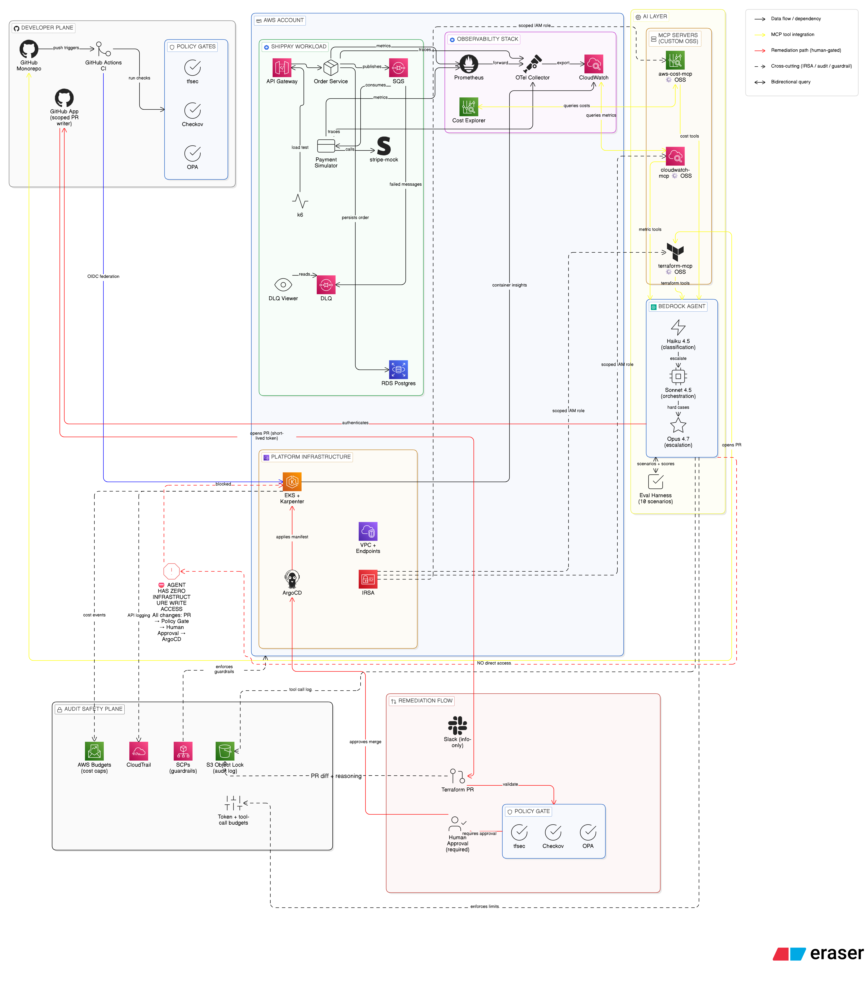

# sentrops
Safe agentic operations for AWS. A reference architecture for delegating cloud ops to LLMs without giving them infrastructure write access.
# SentrOps

**A reference architecture for safely delegating AWS operations to an LLM-based agent.**

SentrOps explores a simple question: how does a platform team let AI diagnose and remediate infrastructure issues *without* giving it write access to production?

The thesis is "propose, never apply." A tiered Claude agent (running on Amazon Bedrock) observes a synthetic payment-processing workload through three custom open-source MCP servers, diagnoses cost and reliability incidents, and proposes Terraform pull requests. Every proposal passes the same tfsec + Checkov + OPA policy gates that human PRs pass, requires human approval, and is applied by ArgoCD. The agent has zero direct infrastructure write access — by design.

## Architecture

The system is organized in five layers:

1. **Developer plane** — GitHub monorepo, CI with OIDC federation, policy gates
2. **AWS account** — ShipPay demo workload on EKS, observability stack, platform infrastructure
3. **AI layer** — three custom MCP servers, tiered Bedrock agent (Haiku → Sonnet → Opus), eval harness
4. **Remediation flow** — Slack notifications for info-only incidents; Terraform PR → policy gates → human approval → ArgoCD for changes
5. **Audit and safety plane** — immutable tool-call and PR audit logs, cost caps, SCP guardrails, per-run token budgets

## What makes this different from other "EKS + Bedrock" projects

- **Three open-source MCP servers** exposing AWS Cost Explorer, CloudWatch, and Terraform operations as LLM-invokable tools (published separately)
- **Zero-write-access agent design** — every mutation flows through PR + policy gates + human approval; the agent literally cannot apply infrastructure changes
- **10-scenario eval harness** with ground truth, measuring agent accuracy and cost-per-correct-action
- **FinOps first-class** — unit economics dashboards ($/request), rightsizing automation, hard cost caps

## Status

🚧 **In active development.** Portfolio project targeting May 2026. Architecture is final; implementation in progress.

| Component | Status |
|---|---|
| Architecture + ADRs | In progress |
| Terraform landing zone (EKS, IRSA, VPC, ArgoCD) | Planned |
| ShipPay workload (5 FastAPI services) | Planned |
| Observability stack (Prometheus, OTel, CloudWatch) | Planned |
| aws-cost-mcp, cloudwatch-mcp, terraform-mcp | Planned |
| Bedrock agent + eval harness | Planned |

## Tech stack

AWS (EKS, Karpenter, IRSA, SQS, RDS, CloudWatch, Cost Explorer, Bedrock) · Terraform · ArgoCD · Python 3.12 + FastAPI · Prometheus · OpenTelemetry · tfsec · Checkov · OPA · MCP (Model Context Protocol) · Claude (Haiku 4.5, Sonnet 4.5, Opus 4.7)

## Author

Built by [Shreya Poojary](https://www.linkedin.com/in/[your-linkedin-handle]) — Senior DevOps & Cloud Engineer, MS-MIS at UIC. This is a portfolio project exploring where DevOps is heading: safe, audited, agent-assisted operations.
